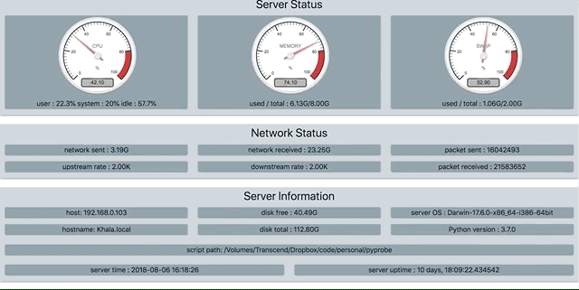

# pyprobe
Display and monitor your servers statistics



| **`installation`** |
```
virtualenv pyprobe_env -p python3
source pyprobe_env/bin/activate
pip install -r requirements.txt
python server.py &
```
open http://localhost:8000/